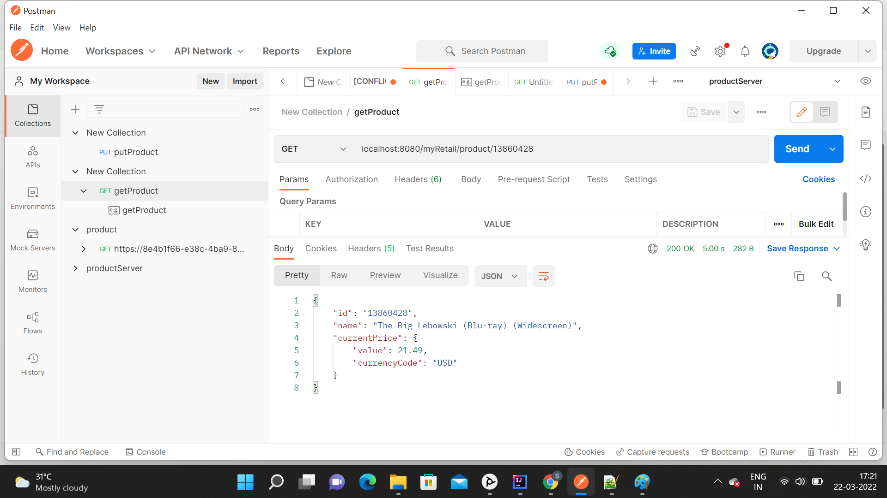
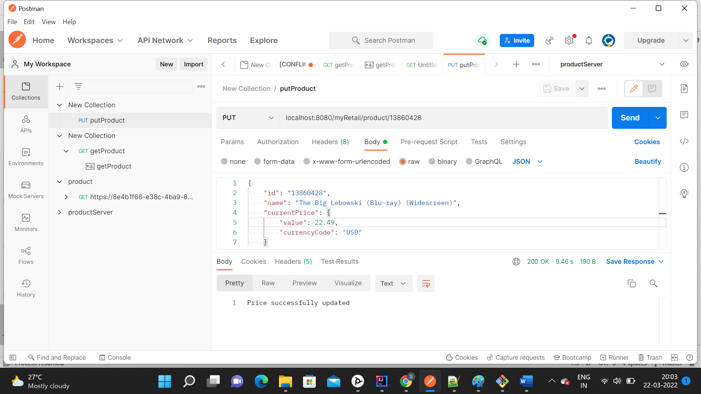

# myRetail RESTFul Service

## Description
1. This project is build using SpringBoot and exposes 2 REST endpoints : GET and POST on /products/{id}.
   
    
2. The project contains a dockerfile that is used to containerize the project. 
3. The project can be deployed in Kubernetes by using deployment.yaml and service.yaml 
files present in k8s-templates folder.
4. Error scenario handling while calling downstream service : 
     a) Has a support to retry calling downstream service 3 times, 
        this retry will occur after certain duration to avoid bottleneck at the downstream level.
        (This scenario totally depends upon a business requirement as it could be a costly operation)
     b) If service won't respond for certain milliseconds, it will get timed out.
   
5. Mongo db atlas is used as a no-SQL database for the project. 
    As Complex queries needs to be made on this data, so that's why selected row based oriented DB which is "MongoDB".
   
6. Unit-test cases have been added(using mocking) to test the interfaces.
7. 
## Requirements
For this project to work an environment variable with the name "DOWNSTREAM_URI" has to be created which should
contain the URL of the external API server. The code will append the "{productId}" to this URL
to fetch the data from supplied URL.

## Future Enhancements
**Caching:**
1. Caching MongoDB query results using Hazelcast. This will reduce latency
2. Hazelcast(an in-memory DB) can also be used for the following:
       i) caching common data : as more number of microservices are added to the project, in-memory caching 
         can be used for caching common DTOs and for data interchange
      ii) distributed cache cluster : makes data fault-tolerant and scalable.
          If a member goes down, the data is repartitioned across the remaining members.
**Spring Cloud configuration:**
   Spring Cloud Config provides server-side and client-side support for externalized configuration in a 
   distributed system. With the Config Server, we have a central place to manage external properties 
   for applications across all environments.
**Swagger**
   Swagger UI can be used to generate interactive API documentation that lets users try out the API calls 
   directly in the browser. 

